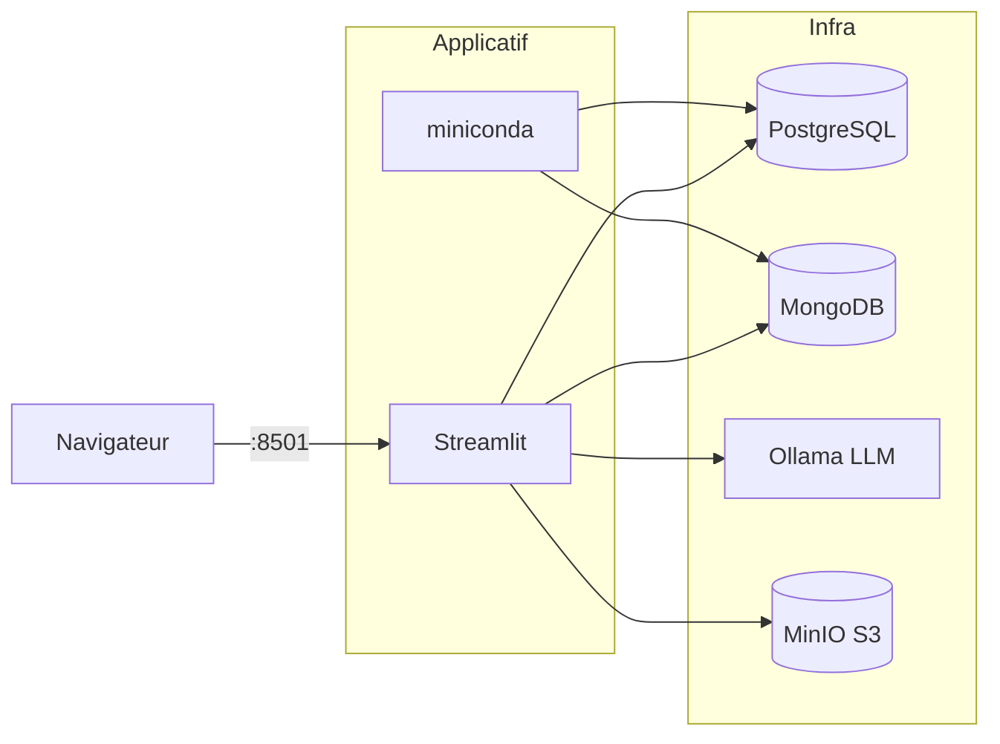

# Template-services-docker

**Squelette Docker Compose regroupant des services centralisés réutilisables — deux bases
de données (PostgreSQL, MongoDB), un LLM local (Ollama/GPU), un stockage objet S3 (MinIO),
un conteneur de calcul Python/Miniconda et une interface Streamlit — préamorcés avec le
jeu de données Iris.**


> Note d'origine : « ici on trouve quelques services centralisés comme BDDs, python
> miniconda, env cuda etc. » — ce dépôt sert de base à cloner pour démarrer un projet
> multi-services sans tout recâbler.

## Architecture

Sept services sur un réseau Docker `app-network` :

- **postgres** — base relationnelle, table `iris`.
- **mongodb** — base documentaire, collection `iris`.
- **ollama** — serveur LLM local (GPU NVIDIA), modèle `phi4-mini:latest`.
- **minio** + **mc-client-init** — stockage objet S3 + job d'amorçage du bucket.
- **miniconda** — conteneur de calcul Python (exécute `connexion_bdd.py`).
- **streamlit** — interface web de test des services.



> Détails : [documentation/architecture.md](documentation/architecture.md)

## Documentation

| Document | Contenu |
|---|---|
| [architecture.md](documentation/architecture.md) | Services, flux, réseaux/volumes, décisions |
| [STORAGE.md](documentation/STORAGE.md) | Stores, persistance, initialisation, reset |
| [SECURITY.md](documentation/SECURITY.md) | Secrets, isolation réseau, risques connus |
| [services/](documentation/services/) | Une fiche par service (7) |

## Démarrage

**Prérequis** : Docker + Docker Compose ; pour `ollama`, un GPU NVIDIA avec
`nvidia-container-toolkit`.

```bash
# Le dépôt fournit déjà un fichier .env (à sécuriser — voir SECURITY.md).
docker compose up -d --build
```

| Service | URL | Note |
|---|---|---|
| Streamlit | http://localhost:8501 | Interface principale |
| MinIO (console) | http://localhost:9001 | Identifiants `minioadmin` / `minioadmin` |
| MinIO (API S3) | http://localhost:9000 | Endpoint S3 |
| Ollama (API) | http://localhost:11434 | `GET /api/tags` |
| PostgreSQL | localhost:5432 | Client SQL |
| MongoDB | localhost:27017 | Client Mongo |

> Attention : `.env` est actuellement versionné avec des mots de passe et il n'y a pas de
> `.env.example`. Voir [SECURITY.md](documentation/SECURITY.md).

## Configuration

Variables principales (fichier `.env`) :

| Variable | Défaut | Effet |
|---|---|---|
| `POSTGRES_USER` / `POSTGRES_PASSWORD` / `POSTGRES_DB` | `myuser` / `mypassword` / `mydatabase` | Identifiants et base PostgreSQL |
| `POSTGRES_PORT` | `5432` | Port PostgreSQL publié |
| `MONGO_ROOT_USERNAME` / `MONGO_ROOT_PASSWORD` / `MONGO_DB` | `admin` / `your_secure_password` / `iris_db` | Identifiants et base MongoDB |
| `MONGO_PORT` / `MONGO_HOST` | `27017` / `mongodb_db` | Port et hôte MongoDB |
| `STREAMLIT_PORT` | `8501` | Port de l'interface web |
| `OLLAMA_PORT` | `11434` | Port de l'API Ollama |
| `OLLAMA_ORIGINS` | `*` | Origines CORS autorisées |
| `OLLAMA_KEEP_ALIVE` | `5m` | Maintien du modèle en mémoire |
| `MINIO_PORT` | `9000` | Port API MinIO (console `9001` en dur) |
| `MINIO_ROOT_USER` / `MINIO_ROOT_PASSWORD` | `minioadmin` / `minioadmin` | Identifiants MinIO |
| `MINIO_BUCKET_NAME` | `my-bucket` | Bucket créé par `mc-client-init` |

## API / Endpoints

L'app Streamlit consomme l'API Ollama :

| Méthode | Route | Rôle |
|---|---|---|
| `GET` | `/api/tags` | Liste des modèles Ollama |
| `POST` | `/api/generate` | Génération de texte |

## Tests

Aucune suite de tests automatisés n'est fournie dans le dépôt. `<à confirmer>` — la
vérification se fait manuellement via l'interface Streamlit (sections PostgreSQL, MongoDB,
Ollama, MinIO) et via les logs du conteneur `miniconda` :

```bash
docker compose logs -f miniconda
```

## Structure du projet

```text
Template-services-docker/
├── docker-compose.yml        # orchestration des 7 services
├── .env                      # variables & secrets (versionné — voir SECURITY.md)
├── LICENSE                   # GPL-3.0
├── postgres/                 # init.sql + Iris.csv
├── mongo/                    # mongo-init.sh + Iris.csv
├── ollama/                   # entrypoint.sh (pull phi4-mini) + init-model.sh
├── minio/                    # data/ (store), images/, init/init.sh
├── python/                   # Dockerfile, environment.yml, src/connexion_bdd.py(.ipynb)
├── streamlit/                # Dockerfile, requirements.txt, src/app.py
├── documentation/            # cette documentation
└── README.md
```

## Licences & composants

| Composant | Rôle | Licence (à vérifier selon version) |
|---|---|---|
| PostgreSQL 15 | Base relationnelle | PostgreSQL License (open-source) |
| MongoDB 7 | Base documentaire | SSPL |
| Ollama | Serveur LLM local | MIT |
| Modèle `phi4-mini` (Microsoft) | Modèle de langage | MIT `<à confirmer>` |
| MinIO | Stockage objet S3 | AGPL-3.0 |
| MinIO Client (`mc`) | Client S3 d'init | AGPL-3.0 |
| Miniconda (`continuumio/miniconda3`) | Env Python | BSD-3-Clause (conda) — canaux Anaconda soumis à leurs propres conditions `<à confirmer>` |
| Python 3.12 (`slim`) | Runtime Streamlit | PSF License |
| Streamlit | Interface web | Apache-2.0 |
| pandas, SQLAlchemy, psycopg2, pymongo, python-dotenv, requests, minio (SDK) | Bibliothèques Python | BSD / MIT / Apache-2.0 (selon lib) |
| **Ce projet** | Code applicatif | **GPL-3.0** — voir [LICENSE](LICENSE) |

> Le fichier [LICENSE](LICENSE) du dépôt est **GPL-3.0** (et non MIT). MinIO/`mc` étant en
> AGPL-3.0, en tenir compte en cas de redistribution.
