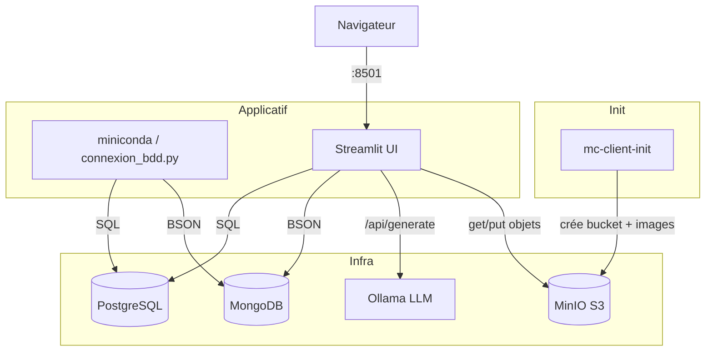

# Architecture — Template-services-docker

## 1. Vue d'ensemble

Ce projet est un **squelette d'infrastructure Docker Compose** qui centralise plusieurs
services couramment réutilisés en développement local : deux bases de données
(**PostgreSQL** relationnel, **MongoDB** documentaire), un serveur **LLM local**
(**Ollama**, accéléré GPU NVIDIA), un stockage objet **S3-compatible** (**MinIO**), un
conteneur de calcul **Python/Miniconda** et une interface web **Streamlit**. Tous les
services partagent un même réseau Docker et sont préamorcés avec le jeu de données
**Iris** (`150` lignes) pour servir de démonstration bout-en-bout.

Le flux nominal : les deux BDD s'initialisent en important `Iris.csv`, Ollama télécharge
un modèle, puis les conteneurs applicatifs (`miniconda`, `streamlit`) se connectent aux
BDD, au LLM et au stockage objet une fois que ceux-ci sont sains (`depends_on ...
condition: service_healthy`).

---

## 2. Services / Composants

| Service | Image / Build | Port interne | Port hôte | Rôle |
|---|---|---|---|---|
| `postgres` | `postgres:15` | `5432` | `${POSTGRES_PORT}` (`5432`) | Base relationnelle, table `iris` |
| `mongodb` | `mongo:7` | `27017` | `${MONGO_PORT}` (`27017`) | Base documentaire, collection `iris` |
| `ollama` | `ollama/ollama:latest` | `11434` | `${OLLAMA_PORT}` (`11434`) | Serveur LLM local (GPU), modèle `phi4-mini:latest` |
| `miniconda` | build `./python` (`continuumio/miniconda3`) | — | — (aucun port) | Conteneur de calcul Python, exécute `connexion_bdd.py` |
| `streamlit` | build `./streamlit` (`python:3.12-slim`) | `8501` | `${STREAMLIT_PORT}` (`8501`) | Interface web de test des services |
| `minio` | `minio/minio:latest` | `9000` / `9001` | `${MINIO_PORT}` (`9000`) + `9001` | Stockage objet S3 + console web |
| `mc-client-init` | `minio/mc:latest` | — | — | Job one-shot : crée le bucket et charge les images |

Fiches détaillées : [services/](services/).

## 3. Stack technologique

| Couche | Technologie | Version (source) |
|---|---|---|
| Orchestration | Docker Compose | format `3.8` (`docker-compose.yml:1`) |
| Base relationnelle | PostgreSQL | `15` (image `postgres:15`) |
| Base documentaire | MongoDB | `7` (image `mongo:7`) |
| LLM local | Ollama | `latest` + modèle `phi4-mini:latest` |
| Stockage objet | MinIO + client `mc` | `latest` |
| Calcul Python | Miniconda (`continuumio/miniconda3`) | Python `3.11` (`environment.yml`) |
| Interface web | Streamlit | `1.28.2` (`streamlit/requirements.txt`) |

Bibliothèques Python côté `streamlit` (`streamlit/requirements.txt`) : `pandas 2.1.4`,
`sqlalchemy 2.0.23`, `psycopg2-binary 2.9.9`, `python-dotenv 1.0.0`, `pymongo 4.6.0`,
`requests 2.31.0`, `minio 7.2.15`.

Côté `miniconda` (`python/environment.yml`, `python/requirements.txt`) : `pandas`,
`sqlalchemy`, `psycopg2`, `python-dotenv`, `pymongo` (versions minimales, non figées).

---

## 4. Flux de bout en bout

1. `docker compose up -d --build` construit les images `miniconda` et `streamlit`, tire
   les autres.
2. **PostgreSQL** démarre, exécute `postgres/init.sql` : création de la table `iris` puis
   `COPY` depuis `postgres/Iris.csv`.
3. **MongoDB** démarre ; `mongo/mongo-init.sh` importe `mongo/Iris.csv` via `mongoimport`
   dans la collection `iris`.
4. **Ollama** démarre via `ollama/entrypoint.sh` : lance `ollama serve`, attend, puis
   `ollama pull phi4-mini:latest`.
5. **MinIO** démarre ; une fois sain, `mc-client-init` crée le bucket
   `${MINIO_BUCKET_NAME}` et y copie `minio/images/`.
6. **miniconda** et **streamlit** attendent que `ollama`, `postgres` et `mongodb` soient
   `service_healthy`, puis démarrent.
7. **miniconda** exécute `connexion_bdd.py` (insertions + lectures Postgres/Mongo) puis
   reste vivant (`tail -f /dev/null`).
8. **streamlit** sert l'UI sur `http://localhost:8501` : sections PostgreSQL, MongoDB,
   Ollama (chat) et MinIO (images).

---

## 5. Réseaux & volumes

| Réseau | Services | Rôle |
|---|---|---|
| `app-network` (bridge) | les 7 services | Résolution DNS interne par nom de service (`postgres`, `mongodb`, `ollama`, `minio`), isolation du reste de l'hôte |

| Volume | Type | Monté par | Contenu persistant |
|---|---|---|---|
| `postgres_data` | volume nommé | `postgres` | `/var/lib/postgresql/data` |
| `mongodb_data` | volume nommé | `mongodb` | `/data/db` |
| `ollama_data` | volume nommé | `ollama` | `/root/.ollama` (modèles téléchargés) |
| `./minio/data` | bind mount | `minio` | buckets et objets MinIO |
| `./python/src` | bind mount | `miniconda` | code source Python (édition à chaud) |
| `./streamlit/src` | bind mount | `streamlit` | code source de l'app (édition à chaud) |
| `./postgres/*`, `./mongo/`, `./ollama/entrypoint.sh`, `./minio/init`, `./minio/images` | bind mount (init) | services respectifs | scripts d'amorçage et données |

Détails stockage : [STORAGE.md](STORAGE.md).

---

## 6. Décisions d'architecture

- **Deux bases de données en parallèle (SQL + NoSQL)** : PostgreSQL **et** MongoDB
  chargent le même jeu Iris, **plutôt qu'**une seule, **parce que** le projet est un
  template pédagogique destiné à montrer les deux paradigmes côte à côte. *Limite* :
  duplication du même dataset, aucune synchronisation entre les deux stores.

- **Ollama en LLM local plutôt qu'API distante** : serveur `ollama` conteneurisé avec
  réservation GPU NVIDIA, **plutôt qu'un** appel à une API cloud, **parce que** le
  template vise un fonctionnement 100 % local et sans clé d'API. *Limite* : nécessite un
  GPU NVIDIA + `nvidia-container-toolkit` sur l'hôte ; sans GPU, le service peut échouer
  ou tourner très lentement (`<à confirmer>` — pas de fallback CPU explicite).

- **MinIO comme stockage objet S3 plutôt que système de fichiers** : `minio` +
  conteneur d'init `mc`, **plutôt qu'un** simple dossier partagé, **parce que** cela
  reproduit une API S3 réelle utilisable par le code (`minio` SDK Python). *Limite* :
  identifiants root par défaut (`minioadmin`), à durcir hors démo.

- **Conteneur d'init dédié (`mc-client-init`) plutôt que script inline** : job éphémère
  `restart: "no"`, **plutôt qu'un** `entrypoint` surchargé sur le service `minio`,
  **parce que** l'amorçage (création de bucket + upload) est ainsi isolé, rejouable et ne
  bloque pas le cycle de vie du serveur. *Limite* : un service supplémentaire à suivre
  dans `docker compose ps`.

- **`depends_on` avec `condition: service_healthy`** : les applicatifs attendent les
  healthchecks des BDD/LLM, **plutôt qu'un** simple ordre de démarrage, **parce que**
  cela évite les erreurs de connexion au boot. *Limite* : allonge le temps de démarrage
  initial (le healthcheck Ollama a `start_period: 60s`).

---

## 7. Sécurité (récapitulatif)

Voir [SECURITY.md](SECURITY.md) pour le détail. Garde-fous et points d'attention
principaux :

| Aspect | État |
|---|---|
| Secrets | Centralisés dans `.env`, mais ce fichier est présent dans le dépôt (voir SECURITY.md) |
| Isolation réseau | Réseau `app-network` dédié ; seuls les ports utiles sont publiés sur l'hôte |
| Identifiants par défaut | `minioadmin`/`minioadmin`, `admin`/`your_secure_password`, `myuser`/`mypassword` — à changer |
| Ollama CORS | `OLLAMA_ORIGINS=*` (toutes origines autorisées) |

---

## 8. Limites connues & pistes

| Aspect | Limitation / État | Recommandation |
|---|---|---|
| Secrets versionnés | `.env` avec mots de passe est présent dans le dépôt ; pas de `.env.example` | Ajouter `.env` au `.gitignore`, fournir un `.env.example` sans secret |
| `.env` doublon | La ligne `MINIO_PORT=9000` est présente deux fois (`.env:31-32`) | Supprimer le doublon (sans effet fonctionnel) |
| GPU obligatoire | Ollama réserve un GPU NVIDIA (`docker-compose.yml:60-66`) | Documenter un profil CPU ou rendre la réservation optionnelle |
| Versions `latest` | `ollama`, `minio`, `minio/mc` en `latest` | Épingler des tags pour la reproductibilité |
| Pas de tests | Aucune suite de tests automatisés dans le dépôt | Ajouter des tests d'intégration (connexion aux 4 services) |
| Idempotence init SQL | `postgres/init.sql` ne s'exécute qu'au **premier** démarrage (volume vide) | Documenté ; recréer le volume pour réinitialiser |
